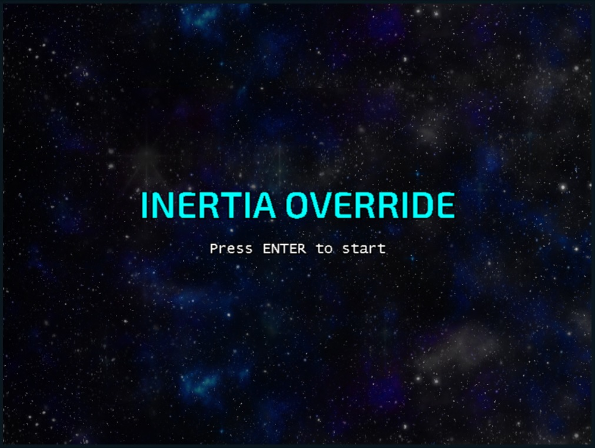

This is my Interactive Milestone Project for the Code Institute. Essentially I set out to create a retro styled 2D Space Invaders/Galaga-esque space shooter game, that I would enjoy playing myself. The idea would be to have simple and easy to understand controls, that anyone can pick up and play with. Anmd the Title "Inertia Override" being in reference to being fast paced movement, and the concenpt of controlling that inertia in the movement of a real life space-craft.

## UX
As games can be addictive, I wanted to use darker colours which would be easier on the users eyes, particularly if the user were to spend and extended period of time playing the game. This was achieved using mostly muted colours in the body of the HTML page and more vibrant contrasting colours represently the player ships lasers, and enemies on screen, making them more easily indentifyable. In part I also wanted to experiement with a paralaxing background (continously scrolling), in order to achieve a sense of continuous space flight when the players ship is otherwise in a stationary position (so as to enhance or otherwise not ruin the fantasy). I thought this would also make a very good backdrop for the initial point of contact the user has when loading the page.

* As a site user, I should see a main menu or title screen when I load up the webpage
* As a site user, I should have some basic instruction on how to start or play the game
* As a site user, the controls for the game should be intuitive an-d easy to pick up and use
* As a site user, I should be able to score points by shooting the onscreen enemies
* As a site user, I should face some in-game challenge, such as triggering Game Over when colliding with a hazard (such as asteroids/enemies)
* As a site user, I should have some sort of win/lose condition, such as a Game Over screen

### Wireframes
My Wireframes can be found here: https://github.com/phillpearsondev/interactive-milestone-project/blob/master/wireframes/WireFrames.pdf

## Features

### Existing Features
* A 800 by 600 window in which the user can play the game
* Parralax, scrolling, Space themed background (Gives a sense of continuous motion)
* A Title screen the user has as their first point of contact (includes instruction on how to start the game)
* Score Counter (for the user to get a feel of how well they are doing in the game)
* Keyboard controls (for the user to control the player ships direction and fire lasers)
* A continuous barrage of asteroids to avoid
* Waves of enemies for the player to avoid and destroy for point (to be added to the score counter)

### Features left to implement
* More diverse waves of enemies, that move in interesting patterns.
* Varied and interesting Boss encounters.
* Multiple Sprites for a more varied enemy to fight.
* More diverse ways of spawning asteroids.
* More diverse backgrounds, to enhance a sense of progression.
* Powerups: such as bonus points. Variation in lasers for the player to use. Extra Lives.
* A HUD element in the game window so the player can keep track of their extra lives.

## How the code works
### Functionality in each file
* <strong>pixi.js</strong>: is a JavaScript Framework with prededined functions that allows use of drawing with canvas or WebGl support, depending on browser capabillity
* <strong>main.js</strong>: Allows the developer to pre-load certain assets before running the. Sets up the Game window. And handle event listeners, like "Keydown"
* <strong>display_utils.js</strong>: Is largely used to define a collection of functions the developer uses to draw anything graphical in the game
* <strong>game_logic.js</strong>: This contains a collection of functions defined for handling the game loop, the score, calling functions from other .js files, starting and ending the game, collisions (between the ship, asteroid and enemy), when to draw the asteroids and enemies and updating the scrolling background
* <strong>guns.js</strong>: A seperate file for drawing the players weaponry, and the logic for checking Bullet to asteroid and bullet to enemy collision

## Technologies Used
* <strong>Visual Studio Code</strong>: My IDE of choice
* <strong>Live Server</strong>: Visual Studio Extension, to disable CORS error and load local files
* <strong>Github Repositories</strong>: To host and store the code
* <strong>Github Pages</strong>: To deploy the code for others users including examiners to to be able to access
* <strong>Git</strong>: Was used to allow local version control, and then push to Gitub Repositories.
* <strong>PIXI.js</strong>: JS Framework for rendering graphics in Canvas or WebGL
* <strong>Krita</strong>: Free image editing software, to make a few aesthetic changes to the graphics
* <strong>Chrome Developer Tools</strong>: For checking the console tab specifically, to <strong>test</strong> if their are any functional errors in the code

## Testing
1. Start the Game
   1. Once the page is loaded you should see the 800x 600px ratio game window
   1. Follow the instruction "Press ENTER to start", and the title text should dissapear
   1. You should now see game objects being rendered, such as the players ship in the center at the bottom of the screen
1. Increase the score
   1. Start the game following the instruction above labelled "Start the Game"
   1. In the top left corner of the screen you should see "score: 0"
   1. Once you see the orangey red enemies ship appear on screen, try shooting them, by using the arrow keys on your keyboard to move the player ship ship, and spacebar on the keyboard to fire your ships lasers.
   1. You should now see the numerical values next to the text "score:" increase in value
1. Game Over
   1. Assuming you've follow the steps to start the Game at the top of the Testing section
   1. Use the arrow keys on your keyboard, and try colliding with the enemies or asteroids displayed on screen
   1. Your player ship ship should be removed from the scene, and you should see the text "GAME OVER" displayed center screen in red

## Deployment
The deployed version of my Game can be found here: https://phillpearsondev.github.io/interactive-milestone-project/

### How was it deployed

* I created a new environment in VS Code
* In the terminal, entered 'git init'
* Created all my folders and files.
* Entered 'git add .' into the bash terminal
* Entered 'git commit' into the bash terminal and created my initial commit
* I then linked my local git repository to a GitHub repository.
* I then followed the below steps to deploy the site to GitHub pages.

### To deploy the website to GitHub pages

* Selected the interactive-milestone-project from my GitHub dashboard.
* Selected 'Settings' from the menu bar.
* From the GitHub pages section, I chose 'master branch' from the dropdown menu.
* Once selected, the page refreshed and a link was displayed in the GitHub pages section to my wesbite.

https://phillpearsondev.github.io/interactive-milestone-project/

### To run this project locally

* Follow this link to the GitHub Repositiry
* Click on the 'Clone or Download' button.
* Copy the URL provided.
* Open a terminal, move to your desired directory.
* Type 'git clone' and paste in the URL.

## Credits

### Media
* The Image for The Player Ship was taken from: https://images.app.goo.gl/2epjPE53tJLtRSjbA and scaled down.
* The Image for the Enemy ships was taken from: https://images.app.goo.gl/j4GczQQ9MjZ28ZuDA and scaled down.
* The Image for the Asteroids was taken from: https://images.app.goo.gl/LduuysUH8tkhMF8a7 and scaled down.
* The Images used in both the Players and Enemy lasers were taken from: https://images.app.goo.gl/ndYYXsgZ9rNRydep8 and scaled down and colorized.

### Acknowledgements
A big thank you to my mentor Reuben Ferrante, for all of his great advice.

* I received inspiration via PIXI.js tutorials from the Youtuber Dower Chin
* I received inspiration from the 1978 Space Invaders Game. An example of which can be found here: http://www.civrays.com/invaders.html
